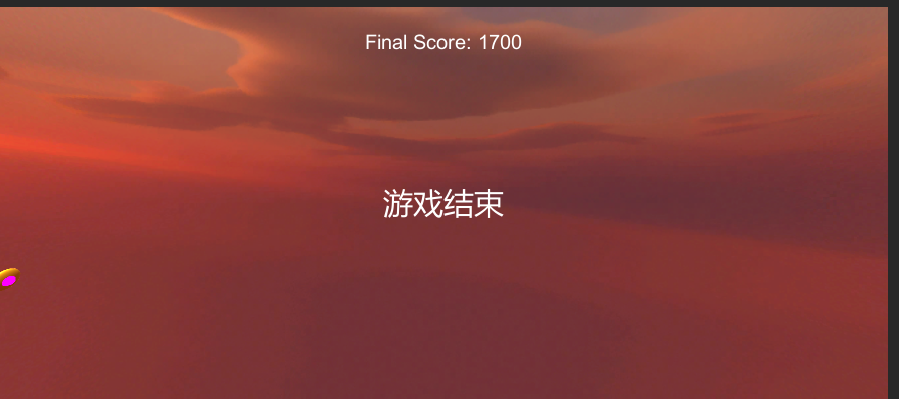
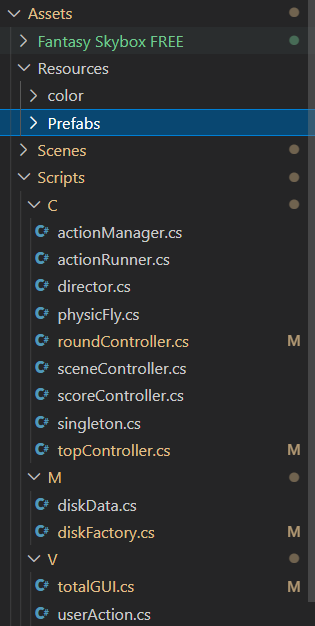

# unity-第五次作业-打飞碟

[TOC]

**视频演示连接**：https://www.bilibili.com/video/BV1YD4y1b7HS/

## 题目


## 游戏说明

打飞碟游戏是一个通过鼠标射击飞碟得分的游戏。游戏共六轮，每轮包括10个轨迹，每轮轨迹中都会朝随机方向以随机速度发射出若干飞碟。飞碟总共有黄色、绿色和蓝色三种，分别计50分、100分和300分，相应的分数越高则速度和加速度越快，越难被射中。每个轮次中的飞蝶数相同，且随着轮次的增加，每轮轨迹射出的飞碟个数也在增加。六轮结束后将显示用户的最终得分。

游戏部分演示画面如下。




## 实现思路

### 项目代码结构



项目采取了MVC结构，将模型、UI和控制器进行分离。类图如下。


根据题目要求，将MVC进行分离，由topController进行统一管理。Controller类和diskFactory都采取了singleton，通过一个singleton类来获得实例。控制器中，scoreController用于计分，sceneController是接口类，声明load函数进行资源导入。roundController用于游戏过程的管理，负责diskFactory类和actionManager类的对接。diskFactory类是工厂类，它负责disk类的生产，向外提供disk的获取与停用（移入等待队列）的方法。生产出的disk在roundController类中将会被转给actionManager，进行动作属性的赋予。actionManager会根据disk的数据按照随机分配的机制将相应的物理动作属性分配给disk，通过速度和恒力来决定disk抛出的轨迹。生成disk并赋予物理属性后，就可以将它释放出来。userAction接口则实现了对用户行动的相应，用户射击命中后就将射击信息返回相应的scoreController进行计分，diskFactory将被射中的disk移入等待队列中。

### 实现细节

#### 预制

由于我们需要生成大量相同外形和物理属性的disk，只需要随机赋予其速度和恒力大小，因此我们可以通过预制（prefab）来完成。我们制作三种颜色的飞碟，然后拖到Resources的Prefabs文件夹中，就可以得到预制飞碟，如下。


得到预制飞碟后，我们可以在程序中进行动态加载。每次需要生成一个disk时，我们只需要从预制中加载一个即可，相应代码如下。

```csharp
        if(!find){
            //加载资源
            Debug.Log(prefabList[level - 1]);
            Debug.Log(Resources.FindObjectsOfTypeAll(typeof(GameObject)));
            var reso =  Resources.Load(prefabList[level - 1]) as GameObject;
            // var reso = AssetDatabase.LoadAssetAtPath<GameObject>(Prefabs[level - 1]);
            Debug.Log(reso);
            //资源初始化
            targetDisk = GameObject.Instantiate<GameObject>(reso, Vector3.zero, Quaternion.identity);
            if(targetDisk != null){
                Debug.Log("succeed init");
            }
            targetDisk.AddComponent<diskData>();
            targetDisk.AddComponent<Rigidbody>();
            targetDisk.AddComponent<ConstantForce>();
        }
```

#### diskFactory工厂类

通过diskFactory来进行飞碟的生成和回收，diskFactory向外提供接口getWaitingDisk和toWaitingList，分别负责生成和回收。理论上，回收过程应该是将disk销毁，生成过程是从prefab中加载，但这样会导致每轮轨迹都有大量的disk生成和销毁，影响效率。因此，这里通过加入disk池的方法，引入一个runningList和waitingList，将回收过程改成将disk从runningList加入到waitingList中，生成过程就先从waitingList中找有无符合要求的disk，如果没有再通过prefab进行生成，如果有直接使用即可。通过这种方式，避免了很多内存分配与释放。相关代码如下。

```csharp
    public GameObject getWaitingDisk(int level){
        Debug.Log(level);
        Debug.Log("getDisk");
        GameObject targetDisk = null;
        bool find = false;
        for(int i = 0; i < waitingDiskList.Count; i++){
            if(waitingDiskList[i].level == level){
                targetDisk = waitingDiskList[i].gameObject;
                waitingDiskList.RemoveAt(i);
                find = true;
                break;
            }
        }

        if(!find){
            //加载资源
            Debug.Log(prefabList[level - 1]);
            Debug.Log(Resources.FindObjectsOfTypeAll(typeof(GameObject)));
            var reso =  Resources.Load(prefabList[level - 1]) as GameObject;
            // var reso = AssetDatabase.LoadAssetAtPath<GameObject>(Prefabs[level - 1]);
            Debug.Log(reso);
            //资源初始化
            targetDisk = GameObject.Instantiate<GameObject>(reso, Vector3.zero, Quaternion.identity);
            if(targetDisk != null){
                Debug.Log("succeed init");
            }
            targetDisk.AddComponent<diskData>();
            targetDisk.AddComponent<Rigidbody>();
            targetDisk.AddComponent<ConstantForce>();
        }
        Debug.Log("nn");
        if(targetDisk != null){

            diskData diskdata = targetDisk.GetComponent<diskData>();
            setDiskData(diskdata, level);
            runningDiskList.Add(diskdata);
        }

        return targetDisk;
    }
    public void toWaitingList(GameObject disk){
        foreach(diskData disks in runningDiskList){
            if(disks.gameObject.GetInstanceID() == disk.GetInstanceID()){
                disk.SetActive(false);
                runningDiskList.Remove(disks);
                waitingDiskList.Add(disks);
                break;
            }
        }
    }
```

#### disk运动控制

这里disk通过三个参数：speed、F和m（即初速度、恒力和质量）来决定运动，通过disk组件中的Rigidbody和ConstantForce来添加这些属性，实现运动。由于这些参数是disk在生成时就被赋予的属性，因此需要将diskData传入，来获取对应的physicFly，如下。

```csharp
    public static physicFly GetPhysicFly(diskData diskdata){
        physicFly flySetup = ScriptableObject.CreateInstance<physicFly>();
        flySetup.F = diskdata.F;
        flySetup.speed = diskdata.speed;
        return flySetup;
    }
    // Start is called before the first frame update
    public void Start(){
        this.gameObject.GetComponent<Rigidbody>().isKinematic = false;
        this.gameObject.GetComponent<Rigidbody>().velocity = speed;
        this.gameObject.GetComponent<ConstantForce>().force = F;
        this.gameObject.GetComponent<ConstantForce>().torque = new Vector3(0.2F,0,-0.2F);
    }
```

获取完成后，就可以将physicFly挂载到disk上。

```csharp
public void fly(GameObject flyingDisk){

        physicflySetup = physicFly.GetPhysicFly(flyingDisk.GetComponent<diskData>());

        doAction(flyingDisk,physicflySetup);

    }

public void doAction(GameObject gameObject, physicFly flyAction){

        Debug.Log("doAction");

        flyAction.gameObject = gameObject;

        flyAction.transform = gameObject.transform;

        waitingFlyQueue.Add(flyAction);

        flyAction.Start();

    } }

```

#### 轮次控制

游戏共有六轮，每轮有一定次数的子轨迹。第一轮过后，每轮的持续时间越来越短，且disk数量越来越多。这是在roundController中控制的，如下。

```csharp
    void Update(){
        Debug.Log("start game");
        if(!gameStart){
            Debug.Log("not start game");
            return;
        }
        time += Time.deltaTime;
        if(roundCount > 6){
            gameStart = false;
            return;
        }
        if(subRoundCount > 10){
            subRoundCount = 0;
            ++roundCount;
            diskCount += roundCount;
        }
        if(time > 2.5f - roundCount * 0.15f){
            time = 0f;
            ++subRoundCount;
            for(int i = 0;i < diskCount;++i){
                GameObject disk = diskfactory.getWaitingDisk((int)Random.Range(1,4));
                disk.transform.position = new Vector3(0,0,0);
                disk.SetActive(true);
                actionmanager.fly(disk);
            }
        }
    }

```


